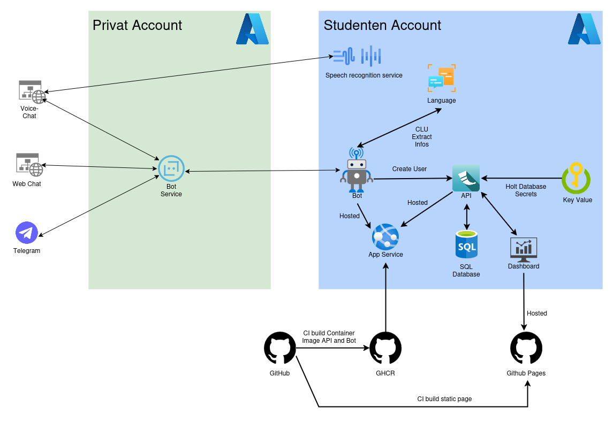

> [!IMPORTANT]
>The repository is only for learning. Do not use this code in production.

# Sprachbot
This project involves developing a voice bot using Azure services to create user accounts.
The bot will engage in natural language conversations to collect necessary user data, including personal, address, and contact information.
Successful implementation will demonstrate proficiency in cloud technologies, speech processing, and database integration.

## Structure

## Bot
The Bot use the Microsoft Botbuilder. 
It is a small Fask Service and will be hosted on the Azure App Service.
To start the Bot ther is an Docker image available.
This Service need some nessary environment variables:
- `MicrosoftAppId`: Is the app id of the Bot Service.
- `MicrosoftAppPassword`: Is the password of the Bot Service.
- `API_URL`: Is the Endpoint of the Api, to create the user.
- `AZURE_CONVERSATIONS_ENDPOINT`: Is the Endpoint of the Azure Conversations Service.
- `AZURE_CONVERSATIONS_KEY`: Is the Key of the Azure Conversations Service.

There are some other environment variables, that can be used to configure the Bot:
- `HOST`: Is the host of the Bot Service.
- `PORT`: The Port of the Bot Service.
- `APP_TYPE`: The Type of the Bot Service. The default is `MultiTenant`.
- `APP_TENANTID`: The Tenant ID of the Bot Service.

The Dialog look like this:

## Dashboard
The dashboard is build with React and Tailwind.
This dashboard provides a comprehensive overview of user data, featuring a detailed table with user information and a visual representation of user distribution across cities.  
It allows for efficient management and analysis of user-related data.
It need a `VITE_API_URL` environment variable to the Endpoint of the API. This can only set in the .env file before the build.

## API
The API is a small Service written in Python using flask.
Need `AZURE_KEY_VAULT_URL` environment variable to the Key Value store of Azure.
The App Service need an enabled Identity

In the Key Value, store must provide the `Key Vault Certificate User` to the App Service.
The following Secrets are needed: 

  - `DATABASE-URL`: Contains the string for the connection to the database. (this contains user, password, URL, etc.)
  - `SECRET-KEY`: The Flask secret key is used to secure session data (sessions), to sign cookies and to protect against CSRF attacks.

## Database
The database is a mssql database on Azure.
The database schema look like this:

## Key Vault
Key Value was used by Azure.
The user must also be given the `Key Vault Data Access Administrator` role in the access control (IAM) in order to create secrets.

## Azure Language Service
The Azure Language Service is used to analyze the user's query and to extract the entities. The Model is trained with extra data for the entities.

## web-chat
The web-chat website needs a `secrets.js` in which the variable `botToken` must be set. This is the token for the Azure Bot Service.

## voice-chat
The voice-chat website needs a `secrets.js` in which the variable botToken must be set.
This is the token for the Azure Bot Service. And the variable speechKey this is for the Azure speech recognition service.